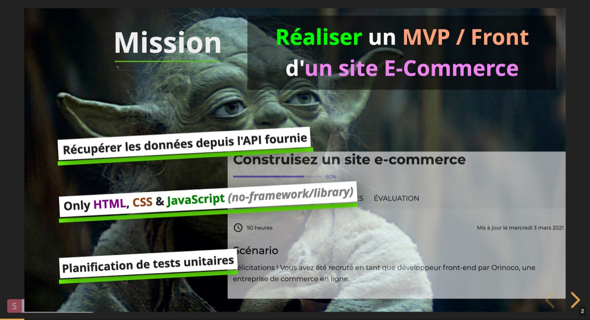

<h1 align="center">Welcome to my MVP/Front E-Commerce 👋</h1>
<p>
  
  <a href="https://en.wikipedia.org/wiki/MIT_License" target="_blank">
    
  </a>
  <a href="https://github.com/ipopop/eb-dev_OC_p4#readme" target="_blank">
    
  </a>
  <a href="https://github.com/ipopop/eb-dev_OC_p4/graphs/commit-activity" target="_blank">
    
  </a>
</p>

### ✨ [Slides presentation](https://slides.com/ipopop/soutenance-p5/fullscreen#/1/0/2)
## A from scratch javascript-only MVP (Minimum Viable Product)



Just an exercise from a Web Development student at OpenClassrooms.com.

This is a draft to test a first refactor of my front e-commerce
project with an OOP (Object Oriented Programming) approach

> I'm new to the business, so please bear with me 🤓


---
## Mission (P5 - Orinoco)

```
Realize an MVP / Front-end of an E-Commerce website

1. - Retrieve data from the provided API (in backend)

2. - Use only HTML, CSS & JavaScript (no framework or JS library)

3. - And finally, make a unit test plan

```

## Installation instructions

The backend (provided by: OC) is available [here](
https://github.com/OpenClassrooms-Student-Center/JWDP5.git)


```
Install the backend and launch it before launching the frontend.

You must have pre-installed NodeJS

1. - Install the backend provided by OC :
     "npm i"

2. - Start the backend server :
     "node server"

3. - And finally, copy this repo
     (the front-end) & launch it :
     for example with VS-Codium
     and "Live Server"

```
---


---
## Authors

👤 **eb-dev**
* Website: maboite.space
* Github: [@ipopop](https://github.com/ipopop)

👤 Website Backend & project definition : [OpenClassrooms](https://openclassrooms.com/fr/paths/185-developpeur-web)
## Show your support

Give a ⭐️ if this project helped you!

## 📝 License

Copyright © 2021 [eb-dev](https://github.com/ipopop).<br />
This project is [MIT](https://en.wikipedia.org/wiki/MIT_License) licensed.

***
_This README was generated with ❤️ by [readme-md-generator](https://github.com/kefranabg/readme-md-generator)_
